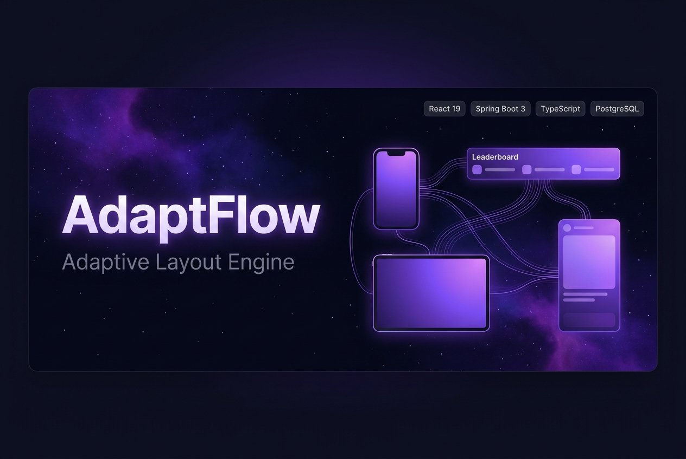

<div align="center">



# AdaptFlow

**Adaptive Layout Engine - Design Once, Render Everywhere**

[](https://react.dev)
[](https://www.typescriptlang.org)
[](https://spring.io/projects/spring-boot)
[](https://www.postgresql.org)
[](https://vite.dev)
[](https://www.docker.com)
[](LICENSE)

<br/>

[](https://adaptflow-frontend.onrender.com)
[](https://adaptflow-backend.onrender.com)

<p align="center">
<strong>AdaptFlow</strong> is a full-stack, constraint-driven adaptive layout engine that automatically
scales, reflows, and re-renders a single ad creative across every IAB/Meta surface with zero manual resizing.
</p>

</div>

---

> ### 🚀 Live Cloud Deployment
>
> | Component | Live URL | Description |
> |---|---|---|
> | 🌐 **Web App (Frontend)** | [**https://adaptflow-frontend.onrender.com**](https://adaptflow-frontend.onrender.com) | Interactive React 19 UI & Multi-Surface Simulator |
> | ⚡ **REST API (Backend)** | [**https://adaptflow-backend.onrender.com**](https://adaptflow-backend.onrender.com) | Spring Boot 3 API with PostgreSQL 16 on Render |
> | 🔑 **Demo Account** | `elena@flam.io` / `password123` | *Admin Account:* `admin@adaptflow.io` / `admin123` |

---

## Table of Contents

- [Overview](#overview)
- [Key Features](#key-features)
- [Architecture](#architecture)
- [Tech Stack](#tech-stack)
- [Project Structure](#project-structure)
- [Getting Started](#getting-started)
- [Environment Variables](#environment-variables)
- [API Reference](#api-reference)
- [Engine Deep Dive](#engine-deep-dive)
- [Pages and Features](#pages-and-features)
- [Live Deployment & Architecture](#live-deployment--architecture)
- [Running Tests](#running-tests)
- [Contributing](#contributing)
- [License](#license)

---

## Overview

Modern advertising campaigns must simultaneously target dozens of surfaces. Traditionally each
variant is designed manually, consuming hours of designer time and introducing inconsistency.

**AdaptFlow solves this** with a constraint solver that takes a single master `LayoutSchema`
and automatically computes safe, proportionally-correct renderings for any target resolution:

- **IAB safe-zone boundaries** — no content in the outer 8% margin
- **Meta/Instagram Story safe zones** — 16–87% vertical range
- **Automatic descender clearance** — text is never clipped
- **Proportional button metrics** — CTA touch targets scale to device DPR
- **Three scaling strategies**: `FIT`, `FILL`, `REFLOW`

---

## Key Features

| Feature | Description |
|---|---|
| **Constraint Solver Engine** | Resolves x/y/width/height across arbitrary target dimensions, respecting safe-zone limits |
| **Multi-Surface Matrix** | Previews 5 surfaces: Banner (300×250), Leaderboard (728×90), Skyscraper (160×600), Story (1080×1920), Square (1080×1080) |
| **iPhone 16 Pro Simulator** | Photorealistic 9:16 chassis with Dynamic Island, three titanium finishes, and Instagram overlay |
| **Drag-and-Drop Editor** | Visual canvas for positioning elements with live constraint previews, powered by @dnd-kit |
| **Asset Library** | Upload, categorize (Logos/Products/Backgrounds), and tag brand assets with cloud-sync status |
| **Live Notifications** | Real-time alerts for sync events, validation passes, and asset uploads |
| **JWT Auth System** | Access + refresh tokens with role-based access (EDITOR / ADMIN) |
| **Docker Compose** | One-command full-stack boot with PostgreSQL, Spring Boot, and Vite |
| **Vitest Test Suite** | Unit tests for the constraint solver and scaling strategies |
| **HTML5 Ad Export** | Download any surface as a self-contained, animated HTML5 ad bundle |

---

## Architecture

```
+-----------------------------------------------------------------+
|                       Browser / Client                          |
|                                                                 |
|  React 19 | TypeScript | Zustand | React Router 7              |
|  [Dashboard]  [Layout Editor]  [Multi-Surface Preview]         |
|                                                                 |
|  +----------------------------+                                 |
|  |  Constraint Solver Engine  |  <-- LayoutSchema (JSON v3.5)  |
|  |  constraintResolver.ts     |                                 |
|  |  scalingStrategies.ts      |                                 |
|  +----------------------------+                                 |
+-----------------------------------------------------------------+
                     | REST / JSON (Axios)
                     v
+-----------------------------------------------------------------+
|               Spring Boot 3.3  (Port 8080)                      |
|  AuthController | LayoutController | AssetController           |
|  Spring Security + JWT | Spring Data JPA | Bean Validation      |
+-----------------------------------------------------------------+
                     | JDBC
                     v
              +------------------------+
              |   PostgreSQL 16        |
              |   (Docker volume)      |
              +------------------------+
```

---

## Tech Stack

### Frontend

| Technology | Version | Purpose |
|---|---|---|
| React | 19.x | UI framework |
| TypeScript | 6.x | Type safety |
| Vite | 8.x | Build tool and dev server |
| Zustand | 5.x | Global state management |
| React Router | 7.x | Client-side routing |
| @dnd-kit | 6/10.x | Drag-and-drop editor |
| Tailwind CSS | 4.x | Utility styling |
| Lucide React | 1.45 | Icon set |
| Axios | 1.x | HTTP client |
| Zod | 4.x | Runtime schema validation |
| Vitest | 5.x | Unit testing |
| OXLint | 1.x | Fast Rust-based linting |

### Backend

| Technology | Version | Purpose |
|---|---|---|
| Spring Boot | 3.3.3 | REST API framework |
| Spring Security | 6.x | Authentication and authorization |
| Spring Data JPA | 3.x | ORM / database abstraction |
| JJWT | 0.12.6 | JWT token generation and validation |
| PostgreSQL | 16 | Primary production database |
| H2 | runtime | In-memory DB for local dev/tests |
| Jackson | — | JSON serialization |
| Maven | — | Build and dependency management |

### Infrastructure

| Technology | Purpose |
|---|---|
| Docker Compose | Multi-container orchestration |
| PostgreSQL 16 Alpine | Containerized production database |

---

## Project Structure

```
adaptive/
├── .env.example                   # Environment variable template
├── docker-compose.yml             # Full-stack Docker orchestration
|
├── frontend/                      # React + Vite application
│   └── src/
│       ├── api/
│       │   ├── apiClient.ts       # Axios instance + interceptors
│       │   └── mockApi.ts         # Mock API with layout schema v3.5
│       ├── components/
│       │   ├── layout/            # Sidebar, header, shell components
│       │   └── renderer/          # ElementNode.tsx
│       ├── engine/                # Core constraint solver
│       │   ├── constraintResolver.ts  # Safe-zone and metrics computation
│       │   ├── scalingStrategies.ts   # FIT / FILL / REFLOW strategies
│       │   ├── engine.ts              # Pipeline orchestrator
│       │   ├── types.ts               # LayoutSchema, ElementNode types
│       │   ├── validator.ts           # Zod schema validation
│       │   └── __tests__/             # Vitest unit tests
│       └── pages/
│           ├── DashboardPage.tsx
│           ├── LayoutEditorPage.tsx
│           ├── MultiSurfacePreviewPage.tsx
│           ├── AssetsLibraryPage.tsx
│           ├── SurfacesPage.tsx
│           ├── SettingsPage.tsx
│           ├── LoginPage.tsx
│           └── RegisterPage.tsx
|
└── backend/                       # Spring Boot application
    └── src/main/java/com/adaptflow/
        ├── AdaptFlowApplication.java
        ├── config/                # Security config, CORS, beans
        ├── controller/
        │   ├── AuthController.java     # /api/auth/**
        │   ├── LayoutController.java   # /api/layouts/**
        │   ├── AssetController.java    # /api/assets/**
        │   └── SurfaceController.java  # /api/surfaces/**
        ├── dto/                   # Request/Response DTOs
        ├── model/                 # JPA entities
        ├── repository/            # Spring Data repositories
        ├── security/              # JWT filter, UserDetailsService
        └── service/               # Business logic layer
```

---

## Getting Started

### Prerequisites

| Requirement | Version | Check |
|---|---|---|
| Node.js | >= 20.x | `node -v` |
| Java | >= 17 | `java -version` |
| Maven | >= 3.9 | `mvn -version` |
| Docker + Docker Compose | Latest | `docker -v` |
| PostgreSQL (optional, manual setup) | 16 | — |

### Quick Start with Docker

```bash
# 1. Clone the repository
git clone https://github.com/<your-username>/adaptive.git
cd adaptive

# 2. Copy the environment template
cp .env.example .env

# 3. Edit .env — update DB_PASSWORD and JWT_SECRET at minimum

# 4. Start all services
docker compose up --build

# Services:
#   Frontend  -->  http://localhost:5173
#   Backend   -->  http://localhost:8080
#   Database  -->  localhost:5432
```

> **Note:** First build downloads Maven and npm dependencies. Subsequent starts are near-instant.

### Manual Setup

#### 1. Database

```bash
docker run -d --name adaptflow-db \
  -e POSTGRES_DB=adaptflow \
  -e POSTGRES_USER=adaptflow_user \
  -e POSTGRES_PASSWORD=change_me \
  -p 5432:5432 postgres:16-alpine
```

Or via psql:

```sql
CREATE DATABASE adaptflow;
CREATE USER adaptflow_user WITH PASSWORD 'change_me';
GRANT ALL PRIVILEGES ON DATABASE adaptflow TO adaptflow_user;
```

#### 2. Backend (Spring Boot)

```bash
cd backend

./mvnw spring-boot:run \
  -Dspring-boot.run.jvmArguments="\
    -DDB_URL=jdbc:postgresql://localhost:5432/adaptflow \
    -DDB_USERNAME=adaptflow_user \
    -DDB_PASSWORD=change_me \
    -DJWT_SECRET=your_min_32_char_secret_here \
    -DCORS_ALLOWED_ORIGINS=http://localhost:5173"

# Or build a JAR first
./mvnw clean package -DskipTests
java -jar target/adaptflow-backend-1.0.0.jar
```

Backend starts at **http://localhost:8080**

#### 3. Frontend (Vite + React)

```bash
cd frontend
npm install
npm run dev
```

Frontend starts at **http://localhost:5173**

---

## Environment Variables

Copy `.env.example` to `.env`:

```env
# Database
DB_URL=jdbc:postgresql://localhost:5432/adaptflow
DB_USERNAME=adaptflow_user
DB_PASSWORD=change_me                 # Change in production!

# JWT (secret must be at least 32 characters)
JWT_SECRET=change_me_min_32_chars_long_secret_key_here
JWT_ACCESS_EXPIRY_MS=900000           # 15 minutes
JWT_REFRESH_EXPIRY_MS=604800000       # 7 days

# CORS
CORS_ALLOWED_ORIGINS=http://localhost:5173

# Frontend
VITE_API_BASE_URL=http://localhost:8080/api
```

> **Security:** Never commit `.env` — it is already in `.gitignore`.

---

## API Reference

All endpoints are prefixed with `/api`. Protected endpoints require:

```
Authorization: Bearer <access_token>
```

### Authentication

| Method | Endpoint | Auth | Description |
|---|---|---|---|
| POST | /api/auth/register | Public | Register a new user |
| POST | /api/auth/login | Public | Login — returns access + refresh tokens |
| POST | /api/auth/refresh | Public | Exchange refresh token for a new access token |

**Login example:**

```json
// POST /api/auth/login
{ "email": "user@example.com", "password": "yourpassword" }

// 200 OK
{
  "accessToken": "eyJhbGci...",
  "refreshToken": "eyJhbGci...",
  "tokenType": "Bearer",
  "expiresIn": 900000
}
```

### Layouts

| Method | Endpoint | Description |
|---|---|---|
| GET | /api/layouts | List all layouts for current user |
| POST | /api/layouts | Create a new layout |
| GET | /api/layouts/{id} | Get a specific layout |
| PUT | /api/layouts/{id} | Update layout schema |
| DELETE | /api/layouts/{id} | Delete a layout |

### Assets

| Method | Endpoint | Description |
|---|---|---|
| GET | /api/assets | List all uploaded assets |
| POST | /api/assets/upload | Upload asset (multipart/form-data) |
| DELETE | /api/assets/{id} | Delete an asset |

### Surfaces

| Method | Endpoint | Description |
|---|---|---|
| GET | /api/surfaces | List all surface definitions |

---

## Engine Deep Dive

The constraint solver lives in `frontend/src/engine/` and runs **entirely client-side** for zero-latency previews.

### LayoutSchema v3.5

```typescript
interface LayoutSchema {
  version: string;      // "3.5"
  id: string;
  name: string;
  elements: ElementNode[];
  tokens: DesignTokens; // brand colors, fonts, spacing
}

interface ElementNode {
  id: string;
  type: "text" | "image" | "button" | "logo";
  x: number;     // 0.0–1.0, normalized to master canvas width
  y: number;     // 0.0–1.0, normalized to master canvas height
  width: number;
  height: number;
  constraints: {
    horizontal: "LEFT" | "RIGHT" | "CENTER" | "SCALE";
    vertical:   "TOP"  | "BOTTOM" | "CENTER" | "SCALE";
    safeZone?: boolean; // enforce IAB / Meta safe-zone boundaries
  };
  content: string | ImageRef;
  style: Partial<CSSProperties>;
}
```

### Scaling Strategies

| Strategy | Behavior |
|---|---|
| `FIT` | Scale to fit within target bounds, preserve aspect ratio. Used for web banners. |
| `FILL` | Scale to fill the target, crop overflow. Used for Story / Reel. |
| `REFLOW` | Re-flow text elements by new available width. Used for adaptive display. |

### Constraint Resolver Pipeline

```
LayoutSchema (v3.5)
  --> validator.ts            Zod schema validation
  --> constraintResolver.ts
        1. computeTextMetrics()    line-height + descender calculation
        2. applySafeZones()        clamp elements within IAB/Meta bounds
        3. resolveConstraints()    map normalized coords to px
        4. validateNoClipping()    throw if any element overflows
  --> scalingStrategies.ts    apply FIT / FILL / REFLOW
  --> Resolved Layout         pixel-perfect, surface-specific
```

---

## Pages and Features

### Dashboard

- Campaign stats: total layouts, sync rate, most-used surface
- Layout cards with thumbnail previews and surface tags (Banner / Story / Square)
- Filter by surface type; sort by last-edited
- **Notification centre** — sync, validation, and upload alerts
- **Profile dropdown** — account settings, surface presets, admin console

### Layout Editor

- Drag-and-drop element positioning via `@dnd-kit`
- Live constraint preview panel
- Design token binding: colors, fonts, spacing
- Undo / redo history

### Multi-Surface Preview

Renders the active layout across **5 surfaces simultaneously**:

| Surface | Dimensions | Category |
|---|---|---|
| Medium Rectangle | 300 × 250 px | IAB Web Banner |
| Leaderboard | 728 × 90 px | IAB Web Banner |
| Wide Skyscraper | 160 × 600 px | IAB Web Banner |
| Instagram Story | 1080 × 1920 px | Social / Mobile |
| Square Post | 1080 × 1080 px | Social |

**iPhone 16 Pro Real-World Simulation:**

- 6.3-inch Super Retina XDR chassis (460 ppi)
- Three titanium finish options: Natural, Black, Desert
- Verified safe-zone checklist (Top Header + Bottom Controls cleared)
- Interactive Dynamic Island with hover animation
- Full Instagram Story overlay (username, sponsored label, send-message bar)
- Export as self-contained HTML5 story bundle

### Assets Library

- Upload PNG, JPG, SVG, WebP up to 25 MB
- Drag-and-drop upload zone with instant preview
- Tabs: Logos / Products / Backgrounds
- File metadata: size, used-in-layouts count, tags, format badge
- Search and category filter

### Settings and Admin

- User profile management
- Workspace configuration
- Surface preset management
- Admin console (ADMIN role only)

---

## Live Deployment & Architecture

AdaptFlow is deployed and fully operational in production on **Render.com**:

| Resource | Service Type | Production URL | Status |
|---|---|---|---|
| **Frontend Web App** | Static Site (Vite + React 19) | [https://adaptflow-frontend.onrender.com](https://adaptflow-frontend.onrender.com) |  |
| **Backend REST API** | Web Service (Docker / Java 17) | [https://adaptflow-backend.onrender.com](https://adaptflow-backend.onrender.com) |  |
| **Database** | Managed PostgreSQL 16 | Render Internal DB (`adaptflow-db`) |  |

### Test Credentials
- **Editor / Creative User:** `elena@flam.io` / `password123`
- **Administrator:** `admin@adaptflow.io` / `admin123`
- *Self-Registration:* Open for new users via the **Register** page.

---

## Running Tests

### Frontend — Vitest

```bash
cd frontend
npm test                        # Run all tests once
npm run test -- --coverage      # With coverage report
npm run test -- --watch         # Watch mode
```

Tests in `frontend/src/engine/__tests__/` cover:

- `constraintResolver` — safe-zone clamping, descender clearance
- `scalingStrategies` — FIT / FILL / REFLOW output correctness
- `validator` — Zod rejection of malformed layouts

### Backend — JUnit + Spring Boot Test

```bash
cd backend
./mvnw test                          # All tests (H2 used automatically)
./mvnw test -Dtest=LayoutServiceTest  # Target a specific class
./mvnw clean verify                   # Full build with verification
```

### Linting

```bash
cd frontend && npm run lint   # OXLint (Rust-based, very fast)
```

---

## Contributing

Contributions are welcome! Please follow these steps:

1. **Fork** the repository
2. **Create** a feature branch:
   ```bash
   git checkout -b feature/your-feature-name
   ```
3. **Commit** using [Conventional Commits](https://www.conventionalcommits.org/):
   ```
   feat: add skyscraper surface to preview matrix
   fix: resolve descender clipping on leaderboard
   docs: update API reference for /assets endpoint
   ```
4. **Push** and open a Pull Request:
   ```bash
   git push origin feature/your-feature-name
   ```

**Code style:**

- **Frontend:** TypeScript strict mode; OXLint rules (see `.oxlintrc.json`)
- **Backend:** Standard Spring conventions; Javadoc on all public APIs
- **Commits:** Conventional Commits format enforced

---

## License

This project is licensed under the **MIT License** — see the [LICENSE](LICENSE) file for details.

---

<div align="center">

Built with React 19, Spring Boot 3, and a constraint-driven design philosophy.

*If this project helped you, please give it a star on GitHub!*

</div>
